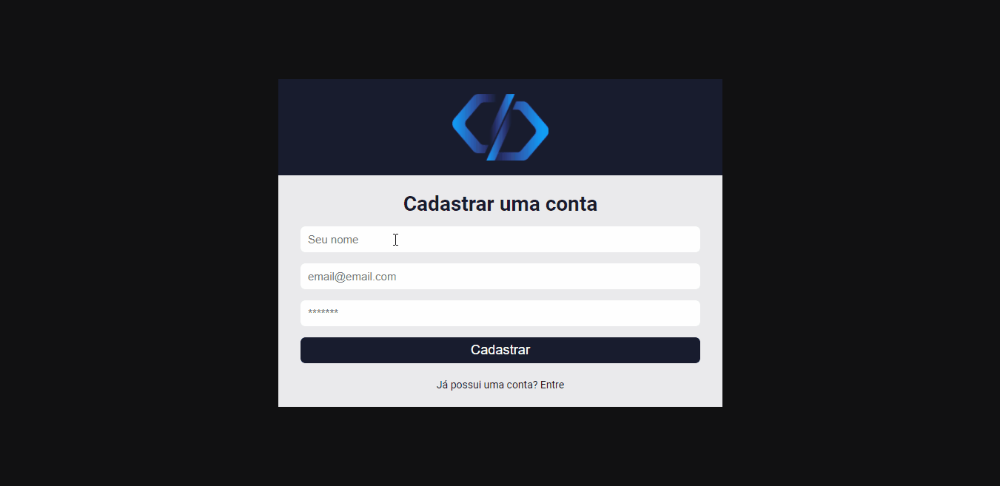

>Projeto Sistema de chamados 
◾ Adicione empresas, crie chamados e edite os mesmos, podendo escolher entre aberto, em andamento ou atendido. Edite seu perfil como preferir e acompanhe o andamento dos chamados;
◾  Nesse projeto é utilizado firebase para a autenticação, cadastro, login e persistência dos dados;
◾  Todo o front-end feito em react.js;
##
### Tecnologias usadas:
<a href="https://pt-br.reactjs.org/docs/getting-started.html" target="blank">React</a>;
 
<a href="https://developer.mozilla.org/pt-BR/docs/Web/JavaScript" target="blank">JavaScript</a>;
 
<a href="https://firebase.google.com/docs">firebase</a>

 

 🤝 Colaboradores

<a href="https://www.linkedin.com/in/marcusviniciusbeghelisantos/" target="_blank">Marcus Vinícius</a> 

